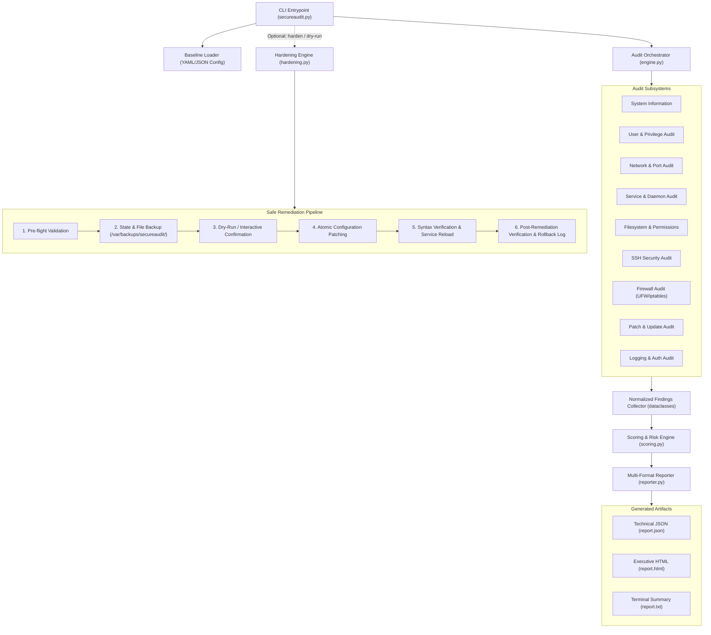

# Phase 1: Project Specifications, System Architecture, & Threat Model

**Project Title:** Linux Security Hardening and Automated Security Audit Toolkit (`secureaudit`)  
**Author / Candidate:** Kartik Soni  
**Context:** SmartED Cybersecurity Internship Minor Project  
**Target OS:** Ubuntu 22.04 / 24.04 LTS, Debian 12, Kali Linux (Validation Environment)  

---

## 1. Project Specifications & Objectives

### 1.1 Scope & Purpose
`secureaudit` is a non-destructive, modular Python 3 and Bash command-line security auditing and automated remediation toolkit. It evaluates target Linux systems against a configurable YAML/JSON security baseline, identifies misconfigurations, computes deterministic security scores (0–100) and risk severities, produces multi-format audit reports (HTML, JSON, TXT), and provides a safe, interactive hardening subsystem equipped with automated backup and rollback capabilities.

### 1.2 Core Design Principles
* **Strict Non-Destructive Default:** Audit mode operates in a read-only manner, leaving zero state modifications on the target system.
* **Defensive Hardening Safeguards:** Hardening modifications require interactive consent (or an explicit `--yes` flag), provide simulated execution (`--dry-run`), generate timestamped backups in `/var/backups/secureaudit/` prior to any file edit, and feature an automated rollback mechanism (`--rollback`).
* **Anti-Lockout Safeguards:** Network and SSH hardening checks verify active connections and validate SSH syntax prior to restarting services, preventing administrator lockout.
* **Safe Subprocess Execution:** Strict prohibition of `shell=True` on dynamic inputs. All system queries execute via parameterized arrays with `shlex` validation to prevent command injection.
* **Zero External Dependency Friction:** Built using Python 3 standard libraries (`dataclasses`, `argparse`, `pathlib`, `subprocess`, `json`, `logging`) with only minimal standard additions (`PyYAML` for baseline parsing, `pytest` for the test harness).

---

## 2. System Architecture



### 2.1 Subsystem Responsibilities
1. **CLI Routing (`src/main.py`):** Parses user commands, flags (`--category`, `--dry-run`, `--config`, `--output`), sets log verbosity, and validates user privileges.
2. **Audit Engine (`src/core/engine.py`):** Coordinates execution across all 8 inspection modules, ensuring uniform result aggregation.
3. **Domain Models (`src/core/models.py`):** Standardizes every finding into an immutable `AuditFinding` dataclass containing check IDs, categories, severity levels, statuses, evidence, and remediation details.
4. **Baseline Manager (`src/core/baseline.py`):** Loads, validates, and queries security baseline configurations from YAML/JSON files.
5. **Scoring Engine (`src/core/scoring.py`):** Calculates an overall deterministic security score (0–100) using category-weighted penalty deductions.
6. **Reporting Subsystem (`src/reporters/`):** Generates structured JSON, terminal formatted text, and responsive executive HTML reports.
7. **Hardening Subsystem (`src/hardening/`):** Executes transactional file edits, configuration backups, syntax validation, and rollback operations.

---

## 3. Complete Directory Structure

```text
linux-security-toolkit/
├── .gitignore
├── LICENSE
├── README.md
├── requirements.txt
├── secureaudit.py                     # Top-level executable launcher
├── config/
│   ├── security_baseline.yaml         # Main YAML security baseline
│   └── security_baseline.json         # Zero-dependency JSON baseline mirror
├── src/
│   ├── __init__.py
│   ├── main.py                        # Primary CLI implementation
│   ├── core/
│   │   ├── __init__.py
│   │   ├── engine.py                  # Audit runner orchestrator
│   │   ├── models.py                  # Dataclasses (AuditFinding, AuditReport, SystemMeta)
│   │   ├── baseline.py                # Baseline parser and schema validator
│   │   ├── logger.py                  # Safe logging (scrubs credentials)
│   │   └── utils.py                   # Subprocess wrappers, safe file I/O, root check
│   ├── modules/
│   │   ├── __init__.py
│   │   ├── system_info.py             # OS, kernel, CPU, RAM, disk, IP metadata
│   │   ├── user_audit.py              # UID 0, empty passwords, root lock, login shells
│   │   ├── network_audit.py           # Listening TCP/UDP ports, promiscuous interfaces
│   │   ├── service_audit.py           # Active/enabled daemons, legacy obsolete services
│   │   ├── filesystem_audit.py        # /etc permissions, SUID/SGID, world-writable files
│   │   ├── ssh_audit.py               # sshd_config settings (root login, auth, ciphers)
│   │   ├── firewall_audit.py          # UFW, iptables status, default policies, SSH rules
│   │   ├── patch_audit.py             # Pending security updates (APT/dpkg), unattended-upgrades
│   │   └── logging_audit.py           # rsyslog, journald, auditd, failed logins
├── logs/                              # Audit log outputs
├── reports/                           # Generated audit reports
├── tests/                             # Pytest automated test harness
│   ├── conftest.py
│   ├── test_baseline.py
│   ├── test_parsers.py
│   └── test_audit_modules.py
└── docs/                             # Project documentation
    ├── phase1_architecture_and_specifications.md
    ├── phase2_core_framework_implementation.md
    ├── phase3_audit_engine_and_inspection_modules.md
    ├── methodology.md
    └── security-policy.md
```

---

## 4. STRIDE Threat Model

| STRIDE Category | Linux Threat Vector | Potential Impact | Audit Check | Remediation |
| :--- | :--- | :--- | :--- | :--- |
| **Spoofing** | Direct SSH root login; empty account passwords | Unauthorized superuser remote access | `SSH-001`, `USR-002` | Set `PermitRootLogin no`; lock passwordless accounts |
| **Tampering** | World-writable critical files (`/etc/shadow`, `/etc/passwd`) | Local privilege escalation | `FS-001`, `FS-002`, `FS-005` | Restore restrictive permissions (`0644` passwd, `0640` shadow) |
| **Repudiation** | Inactive logging daemons (`rsyslog`, `auditd`) | Attackers erase activity traces | `LOG-001`, `LOG-002` | Enable logging services (`systemctl enable rsyslog auditd`) |
| **Information Disclosure** | Cleartext legacy ports (telnet 23, ftp 21, rsh 514) | Interception of plaintext credentials | `NET-001`, `SRV-001` | Disable legacy daemons; enforce SSH/TLS |
| **Denial of Service** | Inactive host firewall (UFW); unpatched kernel CVEs | Service disruption via remote exploit | `FW-001`, `PTC-001` | Enable UFW firewall (`ufw default deny incoming`); apply updates |
| **Elevation of Privilege** | Misconfigured SUID binaries; unauthorized UID 0 accounts | Root privilege escalation | `USR-001`, `FS-006` | Remove non-root UID 0 accounts; revoke unneeded SUID bits |

---

## 5. Security Baseline Specification

The baseline defines 29 checks across 9 categories:
* **System Info (5% weight):** Host hardware, kernel, and OS release parameters.
* **User Security (20% weight):** Exclusivity of UID 0 to root, passwordless account checks, root password status, non-system account login shells, password expiration max age.
* **Network Security (15% weight):** Prohibited unencrypted legacy ports, promiscuous interface detection, kernel sysctl parameters (`ip_forward`, `accept_redirects`, `log_martians`).
* **Service Security (10% weight):** Obsolete daemons detection (`telnetd`, `rsh`, `xinetd`, `vsftpd`).
* **Filesystem Security (15% weight):** POSIX permissions on `/etc/passwd` (0644), `/etc/shadow` (0640), `/etc/group` (0644), `/etc/gshadow` (0640), world-writable file scans, SUID/SGID audit.
* **SSH Security (15% weight):** `PermitRootLogin` (no), `PasswordAuthentication` (no/restricted), `PermitEmptyPasswords` (no), `MaxAuthTries` (<= 4), `X11Forwarding` (no), `Protocol` (2).
* **Firewall Security (10% weight):** UFW active status, default incoming policy (deny/reject), anti-lockout SSH rule verification.
* **Patch Security (5% weight):** Pending APT security updates, `unattended-upgrades` package status.
* **Logging Security (5% weight):** `rsyslog`/`systemd-journald` active status, `auditd` status, PAM/SSH failed authentication log monitoring.

---

## 6. Test-Lab Topology & Development Roadmap

```text
                  ┌──────────────────────────────────────────────┐
                  │          Host System (Windows / Linux)       │
                  │   Hypervisor: VirtualBox / VMware Workstation│
                  └──────────────────────┬───────────────────────┘
                                         │
                   Host-Only Subnet (192.168.56.0/24)
                                         │
        ┌────────────────────────────────┴────────────────────────────────┐
        │                                                                 │
        ▼                                                                 ▼
┌───────────────────────────────┐               ┌─────────────────────────────────┐
│     VM 1: Target System       │               │    VM 2: Auditing / Kali Linux  │
│  OS: Ubuntu 22.04 LTS Server  │               │  OS: Kali Linux 2024.x          │
│  IP: 192.168.56.101           │               │  IP: 192.168.56.102             │
│                               │◄─────────────┤                                 │
│  Role: Target host to audit   │  SSH / Nmap   │  Role: Independent external     │
│        and harden             │  Probes       │        auditor & verification   │
│  Runs: secureaudit.py         │               │                                 │
└───────────────────────────────┘               └─────────────────────────────────┘
```

### Roadmap Phases:
* **Phase 1:** Project Blueprint, Architecture, Baseline, and STRIDE Threat Model (Completed).
* **Phase 2:** Core Framework Foundation (CLI, Models, Logger, Utils, Baseline Parser) (Completed).
* **Phase 3:** Audit Engine & 8 Inspection Modules Implementation (Completed).
* **Phase 4:** Deterministic Scoring Engine & Multi-Format Reporters (HTML, JSON, Console).
* **Phase 5:** Hardening Subsystem, Backup Snapshotting, & Rollback Manifest Engine.
* **Phase 6:** Lab Test Scripts (`setup_vulnerable_lab.sh`, `cleanup_lab.sh`) & Before/After Metrics.
* **Phase 7:** Comprehensive Pytest Suite Expansion & Edge Case Verification.
* **Phase 8:** Internship Report Documentation, Screenshot Execution Plan, & Slide Deck.
